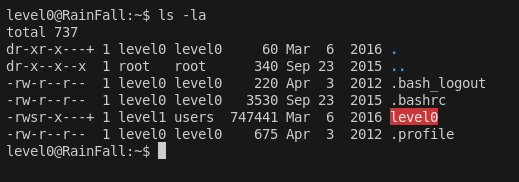
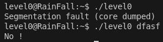
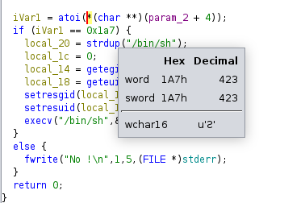

# LEVEL 0

le binaire possede les droits de level1 donc si on arrive a executer un shell et lancer getflag on obtient le flag :

----

Interessont nous au binaire : 

On le decompile grace a ghidra , on voit que si l argument est `0x1a7` ca nous lance un shell
grace a ghidra on obtient meme la valeur a mettre :

----

il suffit juste de lancer le binaire avec 432 et on obtient un shell :)

$ cat /home/user/level1/.pass

1fe8a524fa4bec01ca4ea2a869af2a02260d4a7d5fe7e7c24d8617e6dca12d3a