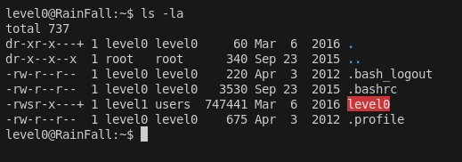
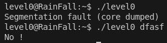
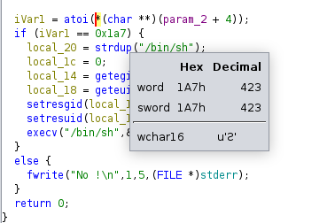

# LEVEL 0

## 1. Introduction

Le binaire `level0` possède les droits de `level1`. Notre objectif est d'exécuter un shell avec ces privilèges pour pouvoir lire le fichier `.pass` du niveau suivant.



## 2. Analyse

### 2.1 Execution du binaire



### 2.2 Droits du binaire
```bash
$ ls -la level0
-rwsr-s---+ 1 level1  level0  747441 Mar  6  2016 level0
```

### 2.3 Analyse avec Ghidra

En décompilant le binaire avec Ghidra, on découvre la logique suivante :

```c
// Fonction principale
int main(int argc, char **argv) {
    if (atoi(argv[1]) == 0x1a7) {
        system("/bin/sh");
    }
    return 0;
}
```

**Point clé :** Si l'argument passé au programme est égal à `0x1a7` (423 en décimal), un shell est lancé.

### 2.4 Conversion hexadécimale

Les caractères en hexadécimal correspondent à **423**



## 3. Exploitation

### 3.1 Méthode
Il suffit de passer la valeur `423` en argument au binaire :

```bash
$ ./level0 423
$ cat /home/user/level1/.pass
1fe8a524fa4bec01ca4ea2a869af2a02260d4a7d5fe7e7c24d8617e6dca12d3a
```

### 3.2 Commandes complètes
```bash
# Se connecter au niveau
ssh level0@<IP> -p 4242

# Exécuter l'exploit
./level0 423

# Récupérer le flag
cat /home/user/level1/.pass
```

## 4. Structure du Payload

### 4.1 Ce qui se passe concrètement

```
┌─────────────────────────────────────────────────────────┐
│                    ARGUMENT SIMPLE                      │
├─────────────────────────────────────────────────────────┤
│  ./level0 423                                          │
│  │                                                     │
│  └─→ atoi("423") == 0x1a7 (423) ✓                    │
│      │                                                 │
│      └─→ system("/bin/sh")                            │
│          │                                             │
│          └─→ Shell avec privilèges level1             │
└─────────────────────────────────────────────────────────┘
```

## 5. Conclusion

Cette vulnérabilité est basée sur une **vérification d'argument simple**. Le programme vérifie si l'argument d'entrée correspond à une valeur hexadécimale spécifique (`0x1a7`). En passant la bonne valeur, on obtient un shell avec les privilèges du propriétaire du binaire (level1). 