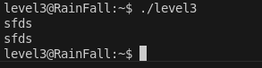
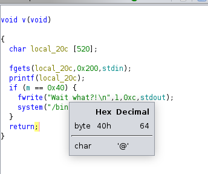
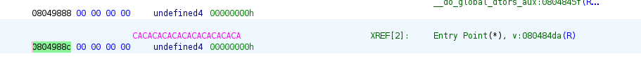
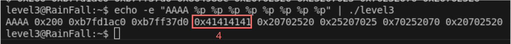
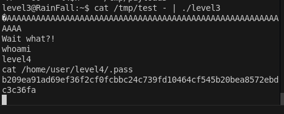

# LEVEL3

## Intro

ici le binaire lit une entrée standard et l'affiche
mais contrairement au level precedent , il l'affiche avec printf, on peut utiliser le string format vulnerability.

On voit ici dans cette condition que si la variable global m est egal a 64 on a un shell qui s'execute.

Avec ghidra on peut voir l'addresse de m ici:

## Construction du payload

On peut utiliser %n, qui va écrire dans l’adresse donnée en argument la valeur du nombre de caractères déjà imprimés
il nous reste a savoir a quel argument printf va lire notre addresse , pour ca on peut simplement tester avec une simple commande : 
`echo -e "AAAA %p %p %p %p %p %p %p %p" | ./level3`

l'address de **AAAA** est **0x41414141** on peut voir ici que c'est a la 4eme position donc printf va le prendre en 4eme argument.
Donc pour le payload on peut utiliser **4$n** ce qui revient a ecrire le nombre de caractères déjà imprimés dans l’adresse donnée par le 4ᵉ argument.

-----

Pour notre payload nous allons donc utiliser l 'addresse de m `\x8c\x98\x04\x08` en little endien, 60 charactere de padding pour arriver a 64, et enfin **4$n** pour ecrire au bon endroit ce qui nous donne : 

`python -c 'print "\x8c\x98\x04\x08" + "A" * 60 + "%4$n"' > /tmp/payload && cat /tmp/payload - | ./level3`

