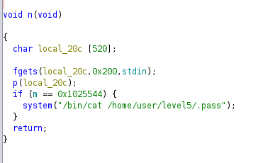
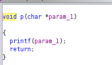
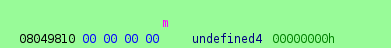
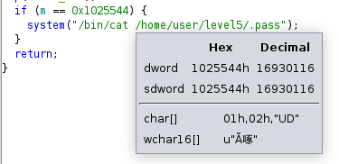
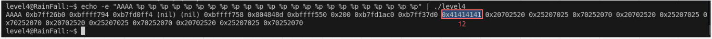

# LEVEL4

## Intro

Cet exercice est exactement le meme principe que le precedent , on a aussi un printf avec un string format a exploiter

On voit que n() fait appelle a p()

et que p() est un simple printf

ici m est a l addresse 08049810 donc \x10\x98\x04\x08 en little endien

On voit aussi ici que il ya beaucoup plus de charactere a ecrire , 16930116 exactement

## Payload

Comme tout a l heure on va utiliser %n pour ecrire le nombre exact de charactere et cette fois si l argument de printf n est pas le meme : 

il se trouve a la **12eme** position. cette fois si pour ecrie au Xeme charactere, on va utiliser **%Nd** de printf, car si on utiliser la meme technique que le niveau d'avant on depasse les **512** bytes. 
Pour la construction du payload il suffit donc d avoir **%16930112d** (la valeur quil faut a m - 4 octet pour l addresse de m)

On obtient donc : 

`python -c 'print "\x10\x98\x04\x08" + "%16930112d%12$n"'`

et on obtient apres un grand nombre de charactere ecrit le flag ! 

0f99ba5e9c446258a69b290407a6c60859e9c2d25b26575cafc9ae6d75e9456a